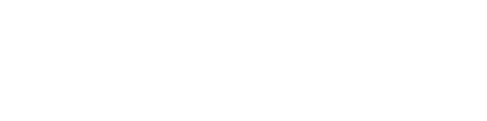

## Hello, it's me Yoann Letacq👋

 

 

✨*Code his life to vibe on it* ✨

 

### 🤖 AI Usage

 

---

### 🛠️ Tech Stack

 

---

 

### 🔨 Github contribution                                                                                 
  
<picture>
  <source media="(prefers-color-scheme: dark)" srcset="https://raw.githubusercontent.com/YoannLetacq/YoannLetacq/output/github-snake-dark.svg" />
  
</picture>
  
 

 

### 📈 Token used today

<picture>
  
</picture>

